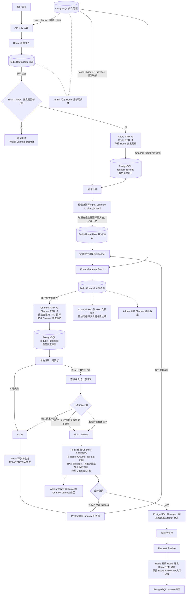

# 功能设计：准入控制

## 摘要

准入控制分为请求层和候选层。当前注册且受保护的公开 `/v1` 端点在 API Key 认证后取得一次
`(Route, User Account)` request-admission token；生成请求在每次准备真实调用一个 Channel 时，再取得新的
候选级 `AttemptPermit`。两层都以 Redis 运行态为执行权威，并在运行态缺失或不同步时 fail closed。

## 请求层准入

- request token 在 API Key 认证后取得一次，入口 RPM、RPD 与并发在 Acquire 时处理；候选 fallback 不重复
  Acquire。handler 返回后，同一 request session 停止 renewer 并唯一 Finalize。
- 只有进入生成或压缩生命周期的请求才在候选预算完成后，一次性、幂等 Reserve 请求层 TPM。候选 fallback
  不重复 Reserve。Reserve 返回 limited 时不写 TPM 桶，但会把 limited 结果固化在仍 active 的 request token；
  handler 返回前继续持有入口并发，随后仍需 Finalize。
- 请求层 RPM、RPD、TPM 和并发使用 Route 的 `NULL` / `0` / 正数覆盖。并发 `NULL` 继承 global key
  concurrency limit，`0` 表示显式不限，正数限制同一 User Account 在该 Route 上的同时在途请求数。
- request-token renew 失败只记录日志，不取消正在执行的 handler；handler 后 Finalize 失败也只记录日志，
  不能改写已经形成的公开响应。

## 候选准备

生成请求按以下顺序进入候选执行：

1. 形成 Route 和候选计划。
2. 对候选执行一次共享、只读的 `SnapshotMany`，取得运行态资格、经济、健康和容量事实，再结合冻结的
   Priority 完成客观评分、确定性排序和逐候选输入 token 估算。
3. 为每个候选计算输入估算和输出预算，形成 `input_estimate + output_budget = candidate_budget`；以所有可用候选
   的最大 `candidate_budget` 一次性 Reserve 请求层 TPM，再完成账务授权。
4. 执行器按冻结候选顺序逐一尝试，在每个真实 transport 前 Acquire 新的 `AttemptPermit`。

`SnapshotMany` 不创建 permit，也不预占 Channel 并发、RPM、RPD 或 TPM。runtime-sync/pending/stale
identity/config 会使整批快照失败；其他不可用状态按候选过滤。快照容量为零不会统一在评分前摘除候选，
排序结果也不是资源取得证明。

## 基础设施与指标链路

PostgreSQL 保存 User、Route、Channel、Provider、模型映射、限额和审计记录；Redis 执行实时准入、预占、释放
和终态记录。Route 记录一次客户逻辑请求，Channel 记录每次具体上游 attempt。两层的 RPM、RPD、TPM 和并发
分别按自己的资源主体运行，不通过前端求和制造等式。

图中的“上游交互证据”不是错误字符串，而是结构化事实：请求是否完整写出、是否拿到响应头、是否出现协议定义
的有效首字。只有证据能够确认请求未写出时，才释放 Channel RPM/RPD/TPM 预占；无法确定时按保守规则保留
可能已经产生的上游消耗。

## AttemptPermit Acquire

候选 Acquire 在一个 Redis 原子操作中检查：

- request token 仍为 active，且已经按不小于当前候选预算 Reserve；
- runtime integrity epoch/revision；
- Provider origin/status control、双 revision 与 fence，以及 Channel 对 Provider 身份的绑定；
- ChannelRate、GlobalConcurrency、CircuitBreaker 和 ChannelAdmission control 的当前 committed revision；
- 当前 429 cooldown 和 `(Channel, Model)` permission pause；
- Provider/Channel breaker 与 half-open 探测租约；
- Channel 并发、RPM、RPD 和 TPM 门槛。

全部检查通过后，脚本才统一写入计数器、并发/half-open 租约和服务端 permit。业务 denial 不创建 permit，
也不改变候选级资源；permit 成功后执行器才创建 attempt 并调用上游。

`AcquireAttempt` 响应丢失重试只在服务端 permit 仍为 `active` 时具备同 ID 幂等性：同 ID、同 fingerprint
返回原 permit；fingerprint 不同，或同 ID 已经 `finished` / `aborted`，均返回冲突。正常 fallback 和短等重试
使用新 permit ID。

## 队首短等与 fallback

只有既有有效 Sticky 绑定在评分后置顶形成的首候选，第一次返回 `concurrency_limited` 或
`rate_limited` 时，才可以在短等预算大于零且客户 deadline 允许的条件下等待一次。普通评分首候选、Sticky
miss 和后续候选均不等待并立即 fallback；429 cooldown 也以 `rate_limited` 表现。

等待期间继续持有 request token、入口并发、已 Reserve 的请求 TPM 和账务授权冻结，但不持有候选级资源。
醒来后不重新 Snapshot、估算、排序或替换候选，只以新 permit ID 重新 Acquire，并强读相关 control revision。
同一 Sticky 固定首候选的 primary 与透明 fallback 共享这一次短等预算。

denied candidate 不创建 attempt、不调用该候选上游。除候选 Acquire Store 错误或
`breaker_store_unavailable` 外，执行器继续后续候选。全部 denial 只有 rate/concurrency 原因时聚合为公开 429；
混合或其他业务 denial 通常聚合为安全 503。

## 资源终结

- Abort 用于 permit 成功但明确没有写出请求的路径，归还候选 RPM、RPD、TPM、并发和 half-open 租约，
  不写 breaker 成功或失败样本。
- Finish 用于请求已经完整写出、收到响应头或产生有效首字的路径，保留有上游交互证据的 Channel RPM/RPD，
  释放并发和 half-open；TPM 优先按权威 usage 对账，没有权威 usage 时至少保留输入估算，有本地输出计量时保留
  输入加本地输出。
- permit 固化 `route_id` 和 `route_channel_rpd_bucket`。Finish 只在有上游交互证据时将一次 attempt 写入该
  Route-Channel UTC 日归因桶；它不替代按 `channel_id` 统计的全局 Channel RPD 容量桶。
- 限额资源按 permit 固化的原始桶身份收口。Finish 不重新校验签发时的 ChannelRate、GlobalConcurrency、
  ChannelAdmission 或 CircuitBreaker revision，而使用当前 committed breaker 配置推进 breaker；流式 TTFT 使用
  当前 committed routing-balance 参数。Provider/Channel 围栏变化可使 breaker/TTFT 写入成为 stale/no-op，
  但资源收口先执行。
- 上述主动收口不适用于 integrity epoch 已换代的 token/permit。Manager 会在 Redis 调用前因 PostgreSQL 当前
  epoch 不匹配而拒绝 request Finalize、permit Finish 或 Abort；Redis 中资源不会由该调用释放，只能等待租约或
  桶 TTL 过期。
- permit renewer 失败只记录日志和指标，不取消 transport。当前 Store 把 expired、unknown permit 和 terminal
  conflict 的 Renew 结果作为 nil 返回，owner 会把它们记录为 `renewed`，所以该指标不能单独证明租约已延长。

## Store 故障行为

| 发生位置 | 当前行为 |
| --- | --- |
| request 或候选 Acquire | fail closed；候选 Acquire 错误停止候选循环并返回安全 503。 |
| request / permit Renew | 只记录日志和指标，已开始的 handler 或 transport 继续。 |
| transport 前 Abort 无法确认 | 记录结果 unknown；原调用错误仍决定是否 fallback。 |
| 成功 transport 的 Finish 无法确认 | 记录 unknown，不反转已经取得的成功响应和 settlement 主路径。 |
| 失败 transport 的 Finish 无法确认 | 停止普通 fallback，按运行态故障收口。 |
| handler 后 request Finalize | 失败只记录日志，不能改写公开响应；integrity epoch 已换代时会在 Redis 调用前失败，入口资源只能等待 TTL。 |

## 限额值语义

请求层 RPM、RPD、TPM 和并发都支持 Route `NULL` 继承对应全局默认、`0` 不执行上限拒绝、正数作为
明确上限。API Key 认证取得绑定 Route 的四类覆盖值，新 request token 在 Acquire 时冻结有效值；已在途
request token 不因 Route 后续修改而改变。

Channel 层 RPM、RPD、TPM 和并发同样支持 `NULL` 继承默认、`0` 不执行上限拒绝、正数作为明确上限。
成功 Acquire 在 `0` 配置下仍写 RPM/RPD 计数和并发 active set；TPM 在候选完整预算大于零时写入。

Channel 层硬限额都以 `channel_id` 为资源主体，不按 Route 拆桶。同一个 Channel 同时加入多条 Route 时，来自
这些 Route 的 attempt 共同消耗该 Channel 的 RPM、RPD、TPM 和并发额度。另有只读的
`(route, channel, UTC day)` attempt 归因桶用于当前 Route 的 Admin 行展示；它不参与全局 Channel 容量判断。
请求层限额与此独立，仍按 `(Route, User Account)` 计数，因此不同 Route 不共享同一个请求层桶。

request RPD、Channel 全局 RPD 和 Route-Channel attempt 归因桶都按 UTC 日编号，并使用覆盖完整日窗口及
permit 终态缓冲的 TTL。Channel 全局 RPD 原始桶在 active permit 生命周期中意外丢失时，Finish/Abort/Renew
不会静默放行或释放，而是返回 runtime-sync-required。

## 状态与边界情况

| 状态或条件 | 当前结果 |
| --- | --- |
| 请求层真实限额命中 | 不创建候选 permit、不调用上游，公开返回 429。 |
| `SnapshotMany` runtime-sync/pending/stale | 整批失败；尚未 Reserve 请求 TPM、授权、创建 attempt 或调用上游。 |
| Sticky 固定首候选 rate/concurrency denial | 无候选资源短等至多一次，然后进入普通 fallback。 |
| 普通候选 rate/concurrency denial | 不等待、不创建 attempt，立即尝试下一候选。 |
| breaker、permission、revision 等业务 denial | 不短等、不创建 attempt；继续后续候选。 |
| 候选 Acquire Store 故障 | 停止执行，释放账务授权并返回安全 503。 |
| transport 已开始后配置变化 | 调用、billing 和审计继续；资源按原桶收口，breaker/TTFT 结果可能因当前配置与围栏变为 no-op。 |
| transport 或 handler 结束前 integrity epoch 换代 | Finish/Abort/Finalize 在 Redis 调用前失败；调用结果仍按业务路径处理，运行资源依赖租约/TTL 过期。 |
| `0` 改为有限值 | 新 Acquire 应用新门槛；Channel 全局 RPD 日桶继续保留完整 UTC 日计数。 |

## 数据、安全与可观测性

运行态包含 active/pending control、独立 revision、完整性标记、服务端 request token / permit 和有界终态记录。
公开 API 不暴露 permit、候选数、Provider、Channel、上游地址、内部 Redis key 或内部 denial reason。Redis 不可用时
没有退回本机限流、并发或 breaker 估计的放行路径。

当前指标、日志和 routing trace 分别记录 allow、limited、fallback、runtime-sync-required、Store 故障、
队首等待、候选跳过与 permit 终结结果。当前没有一条持久记录同时关联 control revision、快照排序、每次
Acquire、真实 transport、终结 disposition 和资源收口。Renew 的 `renewed` 指标同时包含实际延长与
expired/unknown/no-op。

## 当前边界事实

- Redis 状态丢失后的当日 RPD 是否从 PostgreSQL 重建尚未纳入本次开发环境改造；恢复前仍按现有 Redis
  runtime fault 的 fail-closed 规则处理。
- permit Acquire 的同 ID 幂等只覆盖 active 状态；终态 tombstone 上的同 ID 重试会冲突。
- Renew 指标把 expired、unknown permit 和 terminal conflict 记录为 `renewed`，无法证明实际续租。
- integrity epoch 换代会阻断旧 request token 和 permit 的主动 Finalize/Finish/Abort，资源只能等待租约或 TTL。
- 当前运营接口没有从快照、permit、transport 到终结和资源收口的单条关联记录。

## 关联决策

- [ADR-0007：原子准入控制](../decisions/adr-0007-atomic-admission-control.md)
- [ADR-0011：运行时部署边界](../decisions/adr-0011-runtime-deployment-boundaries.md)
